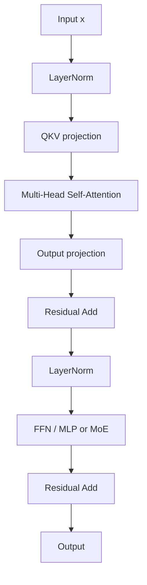
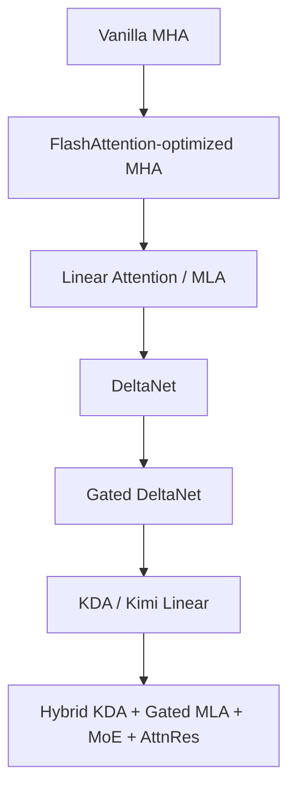

# Kimi K3：沿序列、深度與寬度擴展 LLM

> LLM架構演化，從dense transformer到Kimi K3。

---

LLMS index: [llms.txt](/llms.txt)

---

## 1. LLM 的核心架構

現代 LLM 可以被理解爲**多層（multi-layer）、多頭（multi-head）、且日益多專家（multi-expert）**的系統。

從高層次來看：

- **多層（Multi-layer）**：`L` 個 Transformer 風格的 decoder 層垂直堆疊，形成深度。
- **多頭（Multi-head）**：每個 attention 層使用 `H` 個頭，通常滿足 `d_model = H × d_head`。
- **多專家（Multi-expert）**：許多前沿模型用 **Mixture-of-Experts（MoE）** 層替換 dense FFN/MLP 層，在增大總參數容量的同時，每個 token 只激活一部分專家。

一個標準的 pre-norm decoder block 如下所示：



hidden state 的形狀通常爲：

```text
(B, T, d_model)
```

其中：

- `B` = batch 大小
- `T` = 序列長度
- `d_model` = 隱藏維度

歷史上，`Q`、`K`、`V` 通常由三個獨立的線性投影產生。在優化過的實現中，它們常常被融合成單個投影，以獲得更好的 kernel 效率。

## 2. Attention、路由與知識存儲

`W_q`、`W_k`、`W_v` 投影不應被理解爲直接"發明"新的事實。它們的主要功能更接近**路由與檢索（routing and retrieval）**：

- `Q` 表示當前 token 在尋找什麼。
- `K` 表示其他位置暴露出來供匹配的內容。
- `V` 承載着將被檢索和混合的內容。

在這個視角下，attention 本質上是一種**按內容尋址的路由機制（content-addressed routing mechanism）**。它決定信息應從哪裏來、以及以多大的強度被混合。

習得的事實性知識與變換能力，更多與以下組件相關：

- attention 的輸出投影，
- FFN / MLP 層，
- MoE 專家層，
- 以及在更新的設計中，latent expert 投影與 gated 輸出路徑。

MLP 或 MoE 部分尤其重要，因爲它提供非線性變換，並充當習得行爲的主要存儲基底。

## 3. 面向性能的架構演化

LLM 架構面臨的主要壓力是沿三個維度擴展（scaling）：

1. **序列長度**，
2. **網絡深度**，
3. **模型寬度 / 參數量**。

其架構演化路徑可以概括爲：



### 3.1 Vanilla MHA

原始的 multi-head attention 具有隨序列長度平方增長的複雜度：

```text
O(N²)
```

它表達能力強，提供直接的全局 token 間交互，但在長上下文下代價高昂。

### 3.2 FlashAttention

FlashAttention 保持標準的 softmax attention 形式不變，但改進了內存訪問與 kernel 執行。它主要改變的是**attention 的計算方式**，而非 attention 計算的內容。

### 3.3 Linear Attention 與 MLA

Linear attention 試圖降低序列複雜度：

```text
O(N²) → O(N)
```

這改善了長上下文的可擴展性，但可能損失 full attention 那種精確的全局檢索行爲。

**MLA（Multi-head Latent Attention）** 解決的是另一個瓶頸：KV cache 的大小。MLA 不再緩存每個 head 各自的完整 key 和 value，而是緩存一個壓縮的 latent 表示，並在 attention 計算時重構出 key 和 value，從而在保留全局 attention 行爲的同時降低 KV cache 的內存佔用。Kimi K3 將 Gated MLA 用作其週期性的全局 attention 層[[1]](https://github.com/MoonshotAI/Kimi-K3)。

### 3.4 DeltaNet 與 Gated DeltaNet

DeltaNet 引入了基於 Delta Rule 的高效 recurrent 式記憶更新，實現了可並行的 `O(N)` 序列處理。

Gated DeltaNet 通過一個標量門 `α` 加入遺忘機制，使模型能夠控制保留或覆寫多少記憶。

### 3.5 KDA / Kimi Delta Attention

KDA 在 DeltaNet 式遞歸的基礎上引入了更細粒度的遺忘機制。KDA 不再使用單一的粗粒度標量門，而是採用 **channel-wise retention（逐通道保留）**，允許不同 channel 以不同速率衰減。

在 Kimi K3 中，KDA 進一步做了以下改進：

- **逐 channel 的遺忘門（channel-wise forget gates）**，
- 用於數值穩定性的**有下界衰減（lower-bounded decay）**，
- **chunkwise 並行計算**，
- **full-rank 輸出門控**，
- 以及 FlashKDA 等專用 kernel，用於高效執行。

這使 KDA 成爲一種長上下文序列混合（sequence-mixing）機制，避免了 full attention 中不斷增長的 KV cache。

## 4. 殘差路徑設計：AttnRes

標準的殘差連接將此前所有層的信息壓縮進單一信息流。這簡單且高效，但讓後面的層對早期表示的選擇性訪問能力十分有限。

**Attention Residuals（AttnRes）** 在深度方向上應用類似 attention 的機制。層不再均勻累加此前各層的輸出，而是可以有選擇地從早期表示中檢索。

Kimi K3 使用的是 **Block Attention Residuals**，而非完整的逐層殘差 attention。官方報告稱，這將內存與通信開銷從 `O(Ld)` 降至 `O(Nd)`，其中 `L` 爲層數，`N` 爲殘差塊數量[[1]](https://github.com/MoonshotAI/Kimi-K3)。

具體到 Kimi K3：

- 各層被劃分爲 **12 層的 AttnRes block**，
- 形成 **8 個完整的 12 層 block，外加一個不完整的末尾 block**，
- 且 embedding 也被作爲一個殘差來源。

這比只說"每 12 層一次 AttnRes"更準確：實際機制是**在 embedding 與此前各 block 輸出之上做 block 級的深度檢索**。

## 5. Kimi K3 架構

描述 Kimi K3 最好的方式是三條架構軸線：

1. **序列混合（Sequence mixing）**：Hybrid KDA + Gated MLA。
2. **深度混合（Depth mixing）**：Block Attention Residuals。
3. **寬度 / channel 混合（Width / channel mixing）**：Stable LatentMoE。

這比把"MLA query LoRA""輸出門控（output gating）""SiTU 激活"等條目並列羅列是更好的抽象。那些是重要的實現細節，但主要的架構結構是三軸擴展設計。

### 5.1 序列混合：Hybrid KDA + Gated MLA

Kimi K3 使用一個重複的 **4 層 attention 單元**：

```text
3 × KDA layers + 1 × Gated MLA layer
```

這使高效 linear 式序列混合與完整全局 attention 之間形成 3:1 的比例。

Kimi K3 共有 **93 層**，即 23 × 4 個單元 + 1 個最後的 gated MLA 層。

```text
23 repeating attention units:
  each = 3 KDA + 1 Gated MLA
  total = 69 KDA + 23 Gated MLA

Final layer:
  + 1 Gated MLA

Overall:
  69 KDA + 24 Gated MLA = 93 attention layers
```

### 5.2 深度混合：Block Attention Residuals

Kimi K3 使用 AttnRes 來改善沿深度方向的信息流動。

AttnRes 不再強迫每一層只依賴最新的殘差流，而是讓各層可以有選擇地從以下來源檢索：

- token embedding，
- 此前各 block 的輸出，
- 以及當前 block 已部分累積的輸出。

這改善了深度方向的信息訪問，同時又無需付出"每一層都對所有此前層做 attention"的全部代價。

### 5.3 寬度混合：Stable LatentMoE

Kimi K3 使用 **Stable LatentMoE** 進行稀疏 channel 混合。模型共有 **896 個 routed expert**，每個 token 激活 **16 個 routed expert**，並使用 **2 個 shared expert**[[1]](https://github.com/MoonshotAI/Kimi-K3)。

關鍵思想是 routed expert 路徑在一個更低維的 latent 空間中運作。Kimi K3 的取值爲：

```text
d_model = 7168
latent MoE dimension = 3584
```

因此，expert 路由路徑在模型寬度的一半上運行，在保留大規模專家池的同時降低了通信量與 expert 權重傳輸量。

Stable LatentMoE 加入了若干穩定化機制：

- 在 up-projection 之前加 RMSNorm，
- 用 **SiTU-GLU** 約束激活值增長，
- 用 **Quantile Balancing（QB）** 做 expert 負載均衡。

這一點很重要，因爲在這種規模下，極度稀疏的 MoE 否則容易出現激活不穩定與路由不均衡。

## 6. Kimi K3 關鍵規格

Kimi K3 是一個 **2.78T 參數的 MoE 模型**，每個 token 激活 **104.2B 參數**，hidden dimension 爲 **7168**，有 **96 個 attention head**，訓練上下文長度爲 **1M token**[[1]](https://github.com/MoonshotAI/Kimi-K3)。

| 設計方面 | Kimi K3 的選擇 | 目的 |
|---|---:|---|
| 總層數 | 93 | 更深的骨幹網絡 |
| attention 組成 | 69 KDA + 24 Gated MLA | 高效長上下文混合加週期性全局 attention |
| 重複 attention 單元 | 3 KDA + 1 Gated MLA | 3:1 混合 attention 比例 |
| 額外的最後一層 | 1 個 final Gated MLA | 確保最後一層具有全局 attention |
| hidden dimension | 7168 | 主模型寬度 |
| attention head 數 | 96 | 更高的 attention 並行度 |
| routed expert 數 | 896 | 更大的稀疏專家池 |
| 激活的 routed expert | 每 token 16 個 | 更高的激活容量 |
| shared expert | 2 | 穩定的公共變換路徑 |
| latent MoE 維度 | 3584 | 降低路由路徑開銷 |
| 上下文長度 | 1M token | 長上下文能力 |

## 7. NoPE 與長上下文

Kimi K3 使用 **NoPE**，即不對 MLA 的 query 或 key 應用任何顯式位置編碼。位置與臨近性（recency）信息改由 KDA 的 recurrent 門控與衰減機制隱式處理。

這一點很重要，因爲它避免了 RoPE base 重調或插值之類的上下文擴展 hack。報告稱 Kimi K3 無需修改位置編碼即可外推到 1M token 的上下文[[1]](https://github.com/MoonshotAI/Kimi-K3)。

## 8. 主要架構變化

對 Kimi K3 主要架構變化更一致的總結如下：

1. **Hybrid 序列混合**
   - 3 個 KDA 層後接 1 個 Gated MLA 層。
   - 重複 23 次。
   - 外加最後一個 Gated MLA 層。
   - 最終組成：`69 KDA + 24 Gated MLA = 93 层`。

2. **Block 級深度混合**
   - AttnRes 讓各層可以從 embedding 和此前 block 的輸出中檢索。
   - 以 block 爲單位實現，以控制訓練與推理開銷。
   - 使用 12 層的 block，末尾 block 不完整。

3. **稀疏寬度 / channel 混合**
   - Stable LatentMoE 取代了大部分 dense FFN 容量。
   - 896 個 routed expert，每 token 激活 16 個，2 個 shared expert。
   - latent expert 路徑降低路由開銷。

4. **穩定性與效率機制**
   - SiTU-GLU 限制激活爆炸。
   - RMSNorm 穩定 latent expert 的 up-projection。
   - Quantile Balancing 改善 expert 負載均衡。
   - KDA 與 MLA 中都使用 full-rank 輸出門。

5. **原生多模態輸入路徑**
   - MoonViT-V2 編碼圖像與視頻。
   - 一個輕量的 projector 將視覺特徵映射到共享 embedding 空間，再進入骨幹網絡處理。

## 9. 設計權衡

Kimi K3 體現了若干重要的權衡：

1. **Linear 效率 vs. 全局檢索**
   - KDA 提供高效的長上下文序列混合。
   - 週期性的 Gated MLA 保留完整的全局 token 交互。

2. **深度訪問 vs. 開銷**
   - AttnRes 改善對早期表示的選擇性訪問。
   - Block 級 AttnRes 避免了逐層殘差 attention 的全部內存開銷。

3. **參數規模 vs. serving 成本**
   - MoE 提供非常大的總容量。
   - 稀疏激活使每 token 計算量低於 dense 激活。

4. **專家多樣性 vs. 訓練穩定性**
   - 896 個 routed expert 增強專業化。
   - 需要 SiTU-GLU、RMSNorm 與 Quantile Balancing 來保持系統穩定。

5. **長上下文 vs. 位置編碼複雜度**
   - NoPE 加 KDA 避免了擴展上下文時的 RoPE 重調。
   - Gated MLA 仍提供週期性的全局 attention。

## 參考資料
1. [GitHub - MoonshotAI/Kimi-K3: Open Frontier Intelligence · GitHub](https://github.com/MoonshotAI/Kimi-K3)
