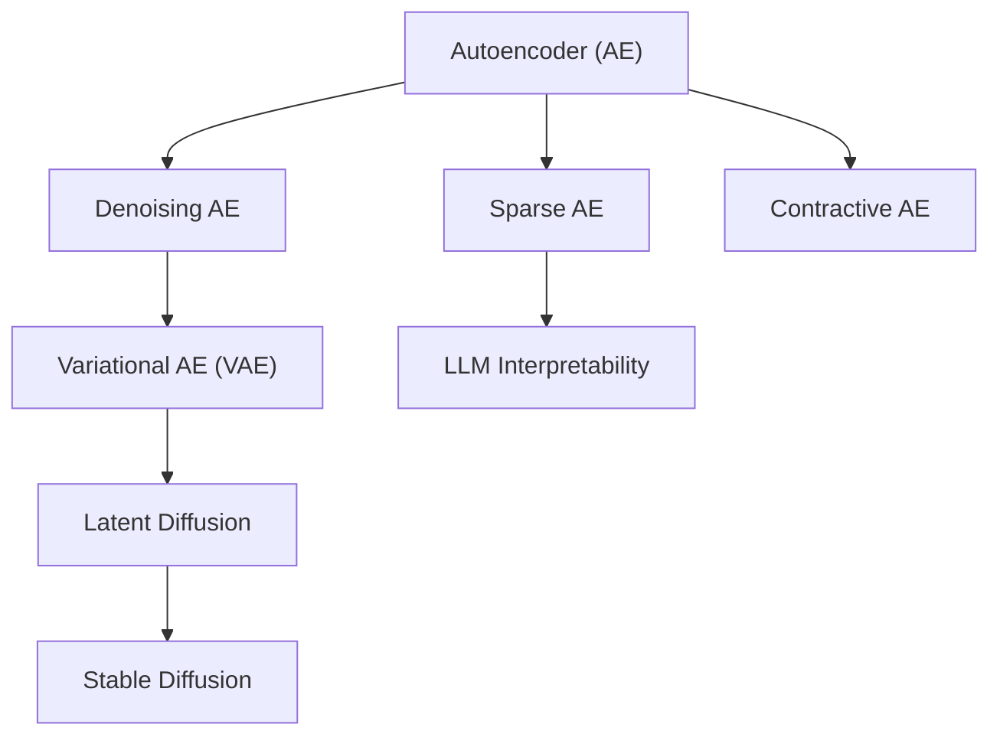
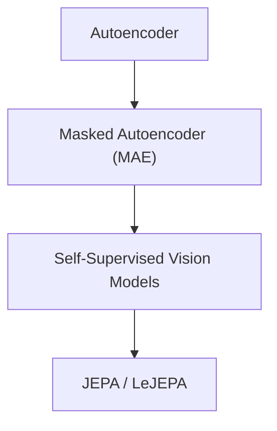

# Music LeJEPA

> 初試Music LeJEPA

---

LLMS index: [llms.txt](/llms.txt)

---

# 表徵學習的發展脈絡

## 表徵派的元信念
表徵派的核心哲學觀點認爲：AI的核心不是 multimodal，也不是 generation，而是 representation。生成是理解的副產物。

不能因爲生成式AI在商業上的巨大成功，就誤以爲“生成即理解”，或“生成式模型可以順帶解決理解問題”。

事實上在VAE之前，autoencoders are not good representation learners。而VAE，又和LeJEPA在先驗上異曲同工。
- Vanilla autoencoders，reconstruction loss = 輸入輸出的L2 loss。
- Sparse autoencoders，在reconstruction loss之外額外引入sparsity loss——限制只有少部分neuron被激活，這樣輸出的embeddings會less entangled，線性可分性更強。目前主要用於可解釋性研究上。
- Denoising autoencoders，以原始信號的degraded views爲輸入，嘗試重建原始輸入，是後世生成式中score-based diffusion的來源。
- Masked autoencoders，即著名的MAE，kaiming嘗試在ViT上覆刻BERT的masked autoencoding，當時被認爲很成功，若干年後回顧，實則是失敗（投入巨量資源，以像素重建爲目標，訓出來的表徵不具備線性可分性，夾雜太多無關特徵，至少在檢索領域是不可用的）。
- Variational autoencoders，真正的革命性範式轉變，在reconstruction loss之外額外引入了讓latent更接近標準高斯的KL項。這和LeJEPA引入SIGReg正則項有異曲同工之妙！

生成式表徵的問題在於訓練目標和“語義層面的理解”背離，或多或少揉入了更表層的理解，比如像素級重建必然會使模型學到局部紋理。即便是VAE也無法和專注於表徵的模型在理解任務指標上媲美。

VAE和LeJEPA的成功，都源於這樣的inductive bias或者說設計哲學：不能只優化任務目標，必須同時對隱空間的"幾何結構"施加統計約束。

## LeJEPA之前SSL的發展脈絡

AE演化出的一條線是生成模型。

另一條線則是自監督表徵學習。

SSL不止Masked生成式自監督這一條線，最自然而然的一個路線是contrastive SSL，如SimCLR、MoCo，依賴構造正負樣本對和hard mining，是有監督對比學習在自監督領域的直接遷移，自然免不了supervised contrastive learning的一系列痛點——contrastive loss訓練不穩定，很難構造可靠的hard mining鏈路，需要巨大的batch size。

繼contrastive SSL、生成式SSL之後，又有一個SSL路線，曰逆向自蒸餾，由Dino系列發揚光大，音樂領域的MERT也用了類似的技術。目前回頭看自蒸餾路線只是一個錯誤嘗試的工程補救而已，沒有可解釋性，也沒有任何借鑑價值——但不代表Dinov3整體沒有借鑑價值，Dinov3的loss有四部分組成，自蒸餾只是其中一部分，其Kelo loss也是一種幾何正則，和LeJEPA的SigReg正則異曲同工。

## LeJEPA：讓SSL從煉丹變成科學
和前世代SSL相比，LeJEPA是極簡的：

$$L_{LeJEPA} = (1-λ) L_{invariance} + λ L_{sigreg}$$

LeJEPA把JEPA目標簡化成invariance loss(所謂的latent prediction) + 幾何分佈正則 SIGReg。

所謂invariance loss，放在音頻檢索領域，其實就是global views和local views對應的projected embeddings的L2 loss。之前也有過類似的做法，比如SimCLR contrastive SSL中的正樣本對之間的距離最小化，但此前的方法未能徹底解決表徵坍塌問題，也沒能找到數學上最優的幾何分佈約束。

# 一些工程實踐
## 初始權重
實踐表明主要基於自然圖像訓練的SOTA預訓練視覺模型Dinov3並不適合作爲初始權重進行SSL，相比從初始化權重開始訓練，invariance loss收斂稍快一點，但sigreg loss收斂緩慢，初始effective ranks極低，在長時間訓練後effective ranks能提升，但有上界，不能持續提升。
- 自然圖像上預訓練太久的模型，容易把所有灰度頻譜圖都視爲極爲接近的。Dinov3 512 output dims上甚至吝嗇到只給4個有效維度給cqt/logmel頻譜圖像。40000 steps後effective ranks增長到40，增長曲線放緩。
- 從隨機化初始化權重開始預訓練。30000 steps後effective ranks增長至100。

## 難度漸進的Curriculum Learning
訓練Degradation-robust Melody Matching模型，需構造各種不破壞旋律的transform，如裁剪、變速變調、施加各種振幅包絡變化、基於足夠豐富的noise bank加噪等。其中大部分invariance學起來比較簡單，但也有一些非常困難需模型有一定基礎後再嘗試學習，如比較極端的加噪，極端的變速變調。

此外，還需實現一個sigreg λ scheduler，隨着訓練步數提升而增加各向同性正則權重。

## Contrastive後訓練
儘管non-contrastive SIGReg正則可以在任何具體下游任務上都有好的表現，effective ranks的爬升是緩慢的，預訓練投入是相當大的。若要迅速見效，可針對具體下游任務，藉助人工標註數據，進行contrastive後訓練。

傳統的Triplet loss在某些場景非常有效，但有更多缺陷：
- 絕大多數triplets沒有梯度。
- 有梯度的那些triplets往往又多出false negative。
- 投入大量人力做人工標註在很多場景又幾乎不可能。
- 真正hard的negatives梯度太大，又會導致訓練震盪。以至於不得不退而求其次找semi hard negatives。
- Offline mining會導致隨着訓練steps導致的embedding分佈變化而越發過期。
- Online mining對超大batch size有需求。
- Mining規則越堆越複雜，heuristics越來越多，以至於越發違反the bitter lesson。

相比之下，大多數contrastive SSL選擇整個batch參與計算的InfoNCE，從訓練鏈路中剔除了複雜、脆弱的hard mining。

Lecun團隊去年提出的X-sample contrastive loss重定義了對比學習的對象——基完整的sample similarity graph，而非pairs進行學習。InfoNCE也可以算作一種粗糙的similarity graph——相似度矩陣中只有positives之間是1，其他都是0——把所有negatives都粗暴歸零，是一種信息浪費。

蘇劍林6月博文[強制間隔投影](https://kexue.fm/archives/11784)中提出一種巧妙的margin loss實現，很適合拉大anchor和negatives之間的margin，比較適配檢索任務，也值得嘗試。

## 可規模化的退化視圖合成
離線做昂貴的基於waveform的退化合成，如變速、變調、混響、NoiseBank加噪。每一項退化設置若干變化幅度，在線生成view時從中任取。
- 維護一個有足夠多樣性的noise bank（人聲歌唱、環境噪聲、白噪聲、各種ugc音頻、音樂、tv）。在waveform進行加噪更合理，更仿真一些。

在線做廉價的基於cqt/logmel tensor的退化合成，如隨機振幅包絡（時間方向緩慢變化），局部能量擾動，隨機噪聲底（在譜圖上添加低幅度噪聲），時頻masking，動態範圍壓縮，頻域EQ（隨機頻率響應曲線，對每個頻帶乘一個緩慢變化的增益），spectral tilt（整體變亮/變暗，高低頻能量傾斜）。

Waveform -> CQT這一步頗昂貴（換LogMel後CPU開銷也仍然可觀），對所有waveform合成都離線化處理，可保證訓練鏈路中，不會在數據pipeline上引入CPU瓶頸。
- 另一種可行的方案是部署一個大規模CQT提取集羣（但我不願意在通用訓練框架中引入對網絡、外部系統的依賴）。
- 還有一種思路是直接用廉價的log mel頻譜代替正統的cqt表示，這很可能是可行的，後續可以做個ablation study。
