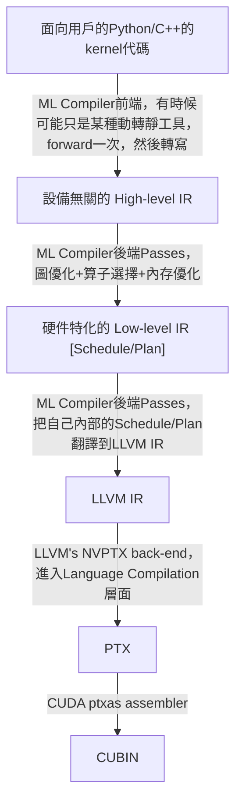

# AI推理優化

> 總結AI工程中的推理優化問題。

---

LLMS index: [llms.txt](/llms.txt)

---

## 優化的幾個抽象層次
應用側的AI Engineering大致上可以分爲MLOps和推理優化。推理優化又可以分爲幾個抽象層次：
1. 最高層是模型優化（詳見[^13]）：量化、知識蒸餾、參數剪枝、通道剪枝。
2. 中間層是圖優化和通用優化：operator fusion/reconstruction、loop interchanges、data layout rewrites。
3. 底層是硬件算子：最優化的底層算子必然是最特化的（tensor-specific + hardware-specific + framework-agnostic），因此需將中層IR綁定到硬件算子（即後端算子選擇），這些硬件算子往往需要根據設備信息，充分利用vectorization、parallelism、locality，做顯式cache管理，通過合理的指令重排隱藏memory latency, 利用SIMD/AMX/DSP/GPGPU架構做memory tiling和minibatch block gemm。
4. 最底層還有LLVM層面的low-level codegen優化，負責最終生成優化的機器碼。

第一層的模型優化減少了模型本身的總計算量，與底層優化正交。第二、第三層的推理優化歸根到底都是硬件使能，只不過二層對幾乎所有硬件都有效，三層則根據設備信息細化。從實現方法上講，二、三層優化又可分爲基於AI編譯器的優化和手工優化。

## 基於編譯的優化
編譯，或者說DSLs + Optimizing Compilers，是解決領域問題優化的一個通用解法，爲不同硬件提供可移植的優化。比如十年前就有Halide爲圖像和張量的並行計算提供了一個DSL+編譯器，將算法規格本身和優化細節解耦。甚至更底層的gcc/llvm本身也是將算法和優化解耦的例子，在machine code codegen層面做的優化。

### ML Compilers的優勢和劣勢
如今的ML compilers是這種基於編譯的思路的延續[^2]，其優勢在於：
- 可移植性：硬件一方面在不斷迭代更新，另一方面也不斷有新硬件、新架構湧現。端邊側的設備要繁雜的多。Datacenter場景還好，但也面臨N卡禁運，國產替代的問題，國產GPGPU還沒有形成明確的一兩家獨大的格局[^10]，因此適配新硬件是近未來必需解決的事情。
- 將算法與優化清晰解耦：工程上可以提效，也有助於降低因複雜度爆炸而注入缺陷、使得項目逐漸失控、無法維護的風險。

其劣勢在於：
- 不完備：在處理大多數場景、常規問題時性能不錯，但總會遇到一些預料之外的edge cases，fallback to the slow path，性能驟然劣化，很難通過tweak DSL code生成更優的代碼。
- 不靈活：考慮到編譯器codegen產物往往不那麼human-readble，工程上針對edge cases、ad-hoc需求做靈活的手工優化就比較困難。
- 難以真正擊敗專家手動優化：正如至今不存在能在性能上擊敗C/C++的函數式語言編譯器，ML compiler也只是給出足夠好的解，通常不及專家充分優化的C/C++實現。

### ML Compilers的工作流程
ML編譯器的工作流是高層抽象到底層抽象的``lowering``過程。ML編譯器後端包含各種``passes``，所謂pass就是lowering規則。最終會根據設備信息，形成一種硬件特化、張量特化的硬件算子描述，這種描述在TVM裏叫做``schedule``，在Triton裏叫做``plan``。再進一步CodeGen階段，是從ML編譯器自己的語言翻譯到language compiler後端，比如LLVM IR，然後交由LLVM編譯成可執行的machine code。

MLIR中``dialects``可對passes進行分層或分類，一個典型的dialects分層(見[^1])自上而下如是：
```
OpGraph -> TSOWB(e.g. late hlo) -> CGASel -> HHO(e.g. Linalg) -> MHA(e.g. stripe/affine) -> HLTSIR(e.g. vector dialects) -> TSIR(e.g. llvm)
```

Triton的大致流程如下：


Intel MLIR graph compiler的lowering pipeline如下：

Computation Graphs -> linalg [^4] -> layout propagation [^7] -> tiling [^3] -> fusion [^8] -> micro kernel [^9] -> vector [^10] -> bufferization [^12] -> memory planning -> LLVM IR -> 交由LLVM處理。

上述lowering pipeline又可分爲tensor-land和memref-land兩個大的區塊，bufferization之前都是tensor-land。在tensor-land，所有tensor操作都默認不是in-place的，哪怕是明顯可以in-place的relu。在memref-land纔會考慮內存訪問的進一步優化。

## 手工優化
很多時候，目標模型的架構是確定的，目標機器的架構也就固定幾種，ML compilers的可移植性優勢——自動算子綁定/算子選擇的優勢——就近乎不存在了。

典型的例子是llama.cpp，和支撐它的ggml，llama.cpp+ggml通過一個人類可讀的最小化C/C++項目，實現了各種精度的量化、自動微分、AVX/AVX2優化、Metal優化、flashatt算子、Multi-GPU pipeline並行等各個抽象層次上最直接有效的優化機制，最終也達成相當好的效果，尤其是在本地設備上。

這種手動優化的系統優勢在於系統是透明的，程序員可以讀懂整個系統，精準定位到涉及某個問題的代碼行，從而具備ML編譯方案中不具備的靈活性，適合應對ad-hoc需求，適用於模型架構和硬件設備穩定的場景。

手動優化的劣勢是一旦出現新架構、新設備，就需要重寫代碼。


[^1]: [Linalg Dialect Rationale: The Case For Compiler-Friendly Custom Operations](https://mlir.llvm.org/docs/Rationale/RationaleLinalgDialect/)
[^2]: TVM可以視爲Halide在ML領域的
[^3]: 算子分塊，或者說矩陣乘法分塊層，屬於scf dialect，即structured control flow，之前叫LoopOps。
[^4]: ``Linalg`` is a DSL(a high-level MLIR dialect) for expressing linear algebra operations in MLIR, designed to solve the High-level Hierarchical Optimization (HHO box) in MLIR and to interoperate nicely within a Mixture Of Expert Compilers environment (i.e. the CGSel box). 
[^5]: [MLIR — Lowering through LLVM](https://www.jeremykun.com/2023/11/01/mlir-lowering-through-llvm/)
[^6]: [A friendly introduction to machine learning compilers and optimizers](https://huyenchip.com/2021/09/07/a-friendly-introduction-to-machine-learning-compilers-and-optimizers.html)
[^7]: 把layout調整好，比如$M\times N$調成$32\times 32$分塊。
[^8]: 算子融合，比如elementwise+reduce的op fusion。
[^9]: micro kernel一般是手寫的，比如分塊後的最小粒度的matmul，一般是64*64的，直接交給編譯器是做不好的，要對不同硬件要用不同指令，不同順序，不同寄存器。
[^10]: 國產AI芯片處於混戰階段：華爲Atlas系列、壁仞BR100、瑞芯微rk NPU、百度崑崙芯XPU、比特大陸（bm-se/sc）、寒武紀MLU、海光DCU、燧原GCU等。
[^11]: 各種vector操作，具體又可分爲GPU dialect，Arm-Neon dialect、x86vector dialect（AVX，AVX512）、第四代Xeon的AMX dialect等。
[^12]: Bufferization in MLIR is the process of converting ops with tensor semantics to ops with memref semantics. 這一階段會盡可能嘗試將一些tensor計算的內存佔用in-place化，終極目標是用更少的內存，減少copy次數。
[^13]: [Quantization and Pruning](https://jipeng4974.github.io/writeups/quantization-and-pruning)
